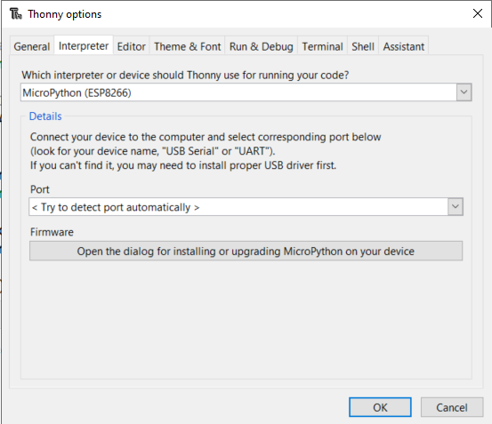
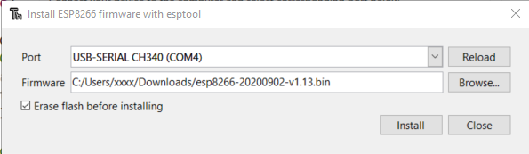
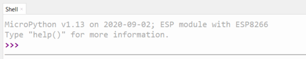

# CircuitPythonDay2020
Este tutorial y código es para los participantes del Circuit Python Day 2020 en Costa Rica hosteado por Greencore.
## Presentación
La presentación del demo/taller [Ver](https://docs.google.com/presentation/d/1kw1N7NGfJhXg8tDW3z9jVUXx_9tk0PStF1oHDXxnyug/edit?usp=sharing)
## Requerimientos Software
* Thonny v3.2.7 [Download](https://thonny.org/)
* Micropython 1.13 ESP8266 Firmware [Download](http://micropython.org/resources/firmware/esp8266-20200902-v1.13.bin)

## Requerimientos Hardware
* ESP8266 Dev Board [Conseguir en Costa Rica](https://www.crcibernetica.com/d1-mini-esp8266-development-board/)
## Preparación Thonny IDE
Thonny es un excelente programa para empezar con Micropython. Incluye todas las herramientas para preparar un dispositivo para Micropython.
### Seleccionar Interpreter para ESP8266
En el menu de Thonny entrar en Tools --> Options --> Interpreter
Selecciona Micropython (ESP8266) 
Si todavia no ha instalado Micropython en su ESP8266 haga click donde dice "Open the dialog for installing or upgrading Micropython on your device".

Selecciona el puerto USB donde esta conectado su dispositivo y la ubicacion del firmware de Micropython

Si la instalación fue exitosa el siguiente mensaje debe aparecer en el Shell

